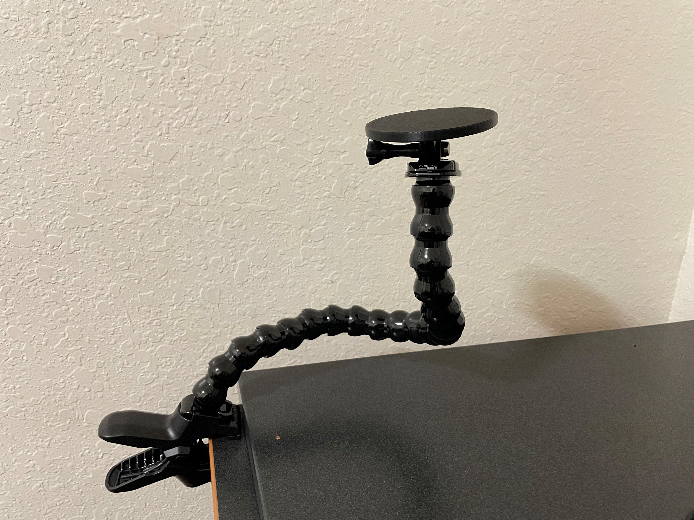

<!--- Open Source Assistive Technology: GitHub Readme Template Version 1.1 (2024-Mar-15)  --->

<!--- TITLE Should match the name of the GitHub repository. Choose something descriptive rather than whimsical.  --->
# Switch Plate - GoPro Compatible

<!---  SUMMARY A brief summary of the project. What it does, who it is for, how much it costs.  --->
The Switch Plate - GoPro Compatible is a cost-effective option for mounting assistive switches. The Switch Plate has a flat surface to which an assistive switch can be attached using hook and loop fastener (e.g., VELCRO). The rear portion of the Switch Plate has a GoPro-compatible mounting interface so the mounting plate can be used with commercially available [GoPro](https://gopro.com/en/ca/) mounting accessories. 

This device is comprised of a single 3D printed part. The overall cost of materials is about $1. This does not include the cost of the GoPro-compatible mounting accessory and additional mounting hardware.

The Switch Plate - GoPro Compatible is open assistive technology (OpenAT). Under the terms of the open source licenses, the device may be built, used, and improved upon by anyone.

Last updated: 2024-May-27. 
The latest version is V1.0. This version has been built and is in use with at least one user.

## Makers Making Change Assistive Device Library
- https://www.makersmakingchange.com/s/product/switch-plate-(gopro-compatible)/01tJR000000TbKMYA0

## How to Obtain the Device
### 1. Do-it-Yourself (DIY) or Do-it-Together (DIT)

This is an open-source assistive technology, so anyone is free to build it. All of the files and instructions required to build the device are contained within this repository. Refer to the Maker Guide below.

### 2. Request a build of this device

You may also submit a build request through the [Makers Making Change Assistive Device Library Listing](<MMCWebLink>) to have a volunteer maker build the device. As the requestor, you are responsible for reimbursing the maker for the cost of materials and any shipping.

### 3. Build this device for someone else

If you have the skills and equipment to build this device, and would like to donate your time to create the device for someone who needs it, visit the [MMC Maker Wanted](https://makersmakingchange.com/maker-wanted/) section.

## Build Instructions

### 1. Read through the Maker Guide

The [Maker Guide](/Documentation/Switch_Plate_GoPro_Compatible_Maker_Guide.pdf) contains all the necessary information to build this device, including tool lists, assembly instructions, and testing.

### 2. Order the Off-The-Shelf Components

The [Bill of Materials](/Documentation/Switch_Plate_GoPro_Compatible_BOM.xlsx) lists the parts and components required to build the device.

### 3. Print the 3D Printable components

All of the files and individual print files can be in the [/Build_Files/3D_Printing_Files](/Build_Files/3D_Printing_Files/) folder.

### 4. Assemble the Switch Plate - GoPro Compatible

Reference the Assembly Guide section in the [Maker Guide](/Documentation/Switch_Plate_GoPro_Compatible_Maker_Guide.pdf) for the tools and steps required to build the device. 

## How to improve this Device
As open source assistive technology, you are welcomed and encouraged to improve upon the design. 

## Files
### Documentation
| Document             | Version | Link |
|----------------------|---------|------|
| Design Rationale     | 1.0     | [Switch_Plate_GoPro_Compatible_Design_Rationale](/Documentation/Switch_Plate_GoPro_Compatible_Design_Rationale.pdf)     |
| Maker Guide          | 1.0     | [Switch_Plate_GoPro_Compatible_Maker_Guide](/Documentation/Switch_Plate_GoPro_Compatible_Maker_Guide.pdf)     |
| Bill of Materials    | 1.0     | [Switch_Plate_GoPro_Compatible_Bill_of_Materials](/Documentation/Switch_Plate_GoPro_Compatible_BOM.csv)     |
| User Guide           | 1.0     | [Switch_Plate_GoPro_Compatible_User_Guide](/Documentation/Switch_Plate_GoPro_Compatible_User_Guide.pdf)    |
| Changelog            | 1.0     | [Changelog](CHANGES.txt)     |

### Design Files
<!--- DESIGN FILES
Include a copy of the original design files to facilitate easy editing and customization. Consider also including a generic format (e.g., STEP)
--->
 - [CAD Files](/Design_Files/CAD_Design_Files)
<!--- - [PCB Files](/Design_Files/PCB_Design_Files) --->

<!--- BUILD FILES
Include a copy of the build files intended for manufacturing. This may include svg files for laser cutting, stl files for 3d printing, Gerber files for custom PCBs, and Arduino files for custom firmware
--->
### Build Files
 - [3D Printing Files](/Build_Files/3D_Printing_Files)
<!--- - [PCB Build Files](/Build_Files/PCB_Build_Files) --->
<!--- - [Firmware Files](/Build/Firmware_Files) --->

<!---
ATTRIBUTION
Provide any necessary attribution for designs or components that are included in the device or as part of the project.
--->
## Attribution

<!--- This is the attribution for the template. --->
The documentation template was created by Makers Making Change / Neil Squire Society and is used under a CC BY-SA 4.0 license. It is available at the following link: [https://github.com/makersmakingchange/OpenAT-Template](https://github.com/makersmakingchange/OpenAT-Template)

<!---
CONTRIBUTORS
List the names of the people that contributed to the design. This could include the original source of the idea, designers, testers, documenters, etc.
--->
### Contributors

 - Anna Millbourn. Design and photos.
 - Michael Camarda. Conceptualization and delivery.
 - Zoey Clontz. Conceptualization and delivery.
 - Dana Mumaw. Conceptualization and delivery.
 - Courtney Welch. Conceptualization and delivery.
 - Jake McIvor. Neil Squire Society / Makers Making Change. Documentation.

<!---
LICENSE
Add the year(s) for the copyright and the Designer Name. You may use the standard set of open licenses or choose your own for the hardware, software, and accompanying materials.
--->
## License
Design Copyright (c) 2024 Anna Millbourn. 

The design is made available using a [Creative Commons Attribution-ShareAlike 4.0 license (CC BY-SA 4.0)](https://creativecommons.org/licenses/by-sa/4.0/)

Documentation Copyright (c) 2024 Neil Squire Society.

Accompanying material such as instruction manuals, videos, and other copyrightable works that are useful but not necessary to design, make, test, or prepare the Switch Mount - GoPro Compatible are published under a [Creative Commons Attribution-ShareAlike 4.0 license (CC BY-SA 4.0)](https://creativecommons.org/licenses/by-sa/4.0/) .

Source Location: https://github.com/makersmakingchange/Switch-Mounting-Plate-GoPro-Compatible

----

<!-- ABOUT MMC START -->
## About Makers Making Change

Makers Making Change is a program of [Neil Squire](https://www.neilsquire.ca/), a Canadian non-profit that uses technology, knowledge, and passion to empower people with disabilities.

Makers Making Change leverages the capacity of community based Makers, Disability Professionals and Volunteers to develop and deliver affordable Open Source Assistive Technologies.

 - Website: [www.MakersMakingChange.com](https://www.makersmakingchange.com/)
 - GitHub: [makersmakingchange](https://github.com/makersmakingchange)
 - Bluesky: [@makersmakingchange.bsky.social](https://bsky.app/profile/makersmakingchange.bsky.social)
 - Instagram: [@makersmakingchange](https://www.instagram.com/makersmakingchange)
 - Facebook: [makersmakechange](https://www.facebook.com/makersmakechange)
 - LinkedIn: [Neil Squire Society](https://www.linkedin.com/company/neil-squire-society/)
 - Thingiverse: [makersmakingchange](https://www.thingiverse.com/makersmakingchange/about)
 - Printables: [MakersMakingChange](https://www.printables.com/@MakersMakingChange)

### Contact Us
For technical questions, to get involved, or to share your experience we encourage you to [visit our website](https://www.makersmakingchange.com/) or [contact us](https://www.makersmakingchange.com/s/contact).
<!-- ABOUT MMC END -->
